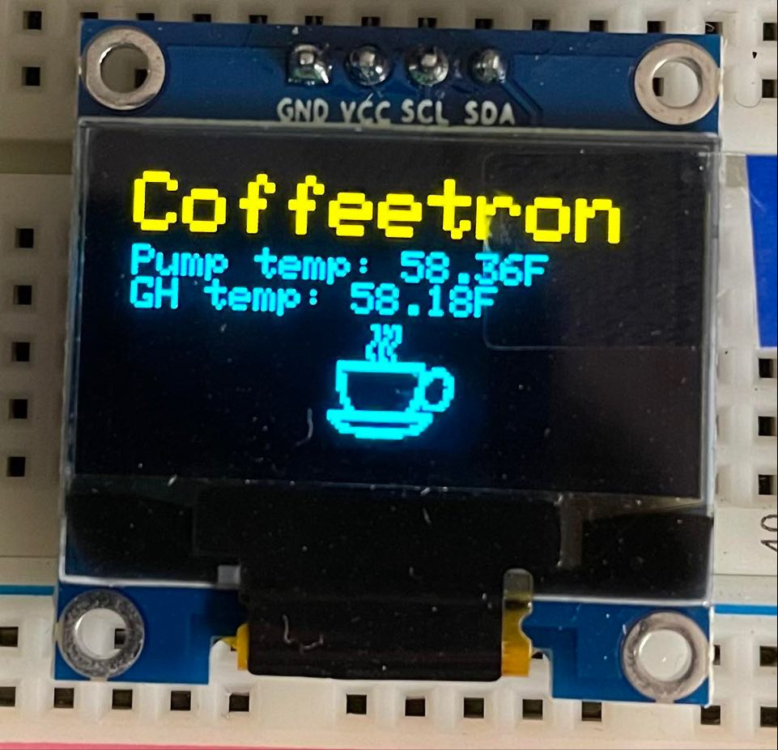
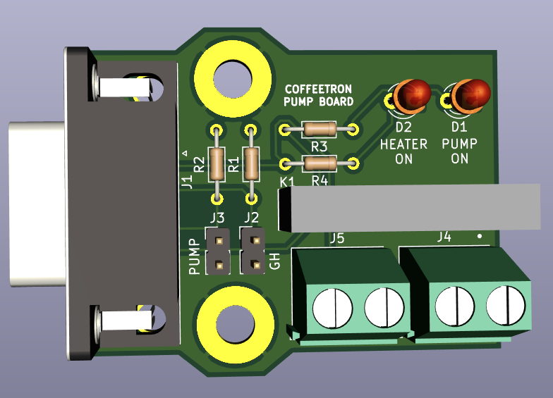

# coffeetron - WIP

Arduino sketch to pour a shot of espresso in a [Gaggia Classic Pro](https://www.gaggia.com/manual-machines/new-classic/) to a specific weight.

Fun side project. Probably does things wrong, and isn't really useful unless you have the same setup I do. Feel free to use as a reference if you want!

## Pump control

## License

[MIT](LICENSE.md)
